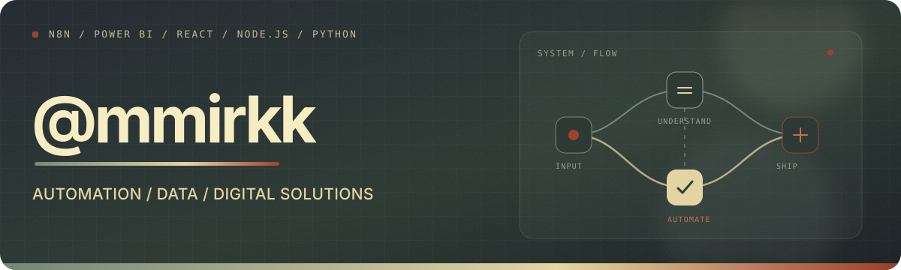

  

<h3 align="center">Automation, data and digital solutions.</h3>

  I build automations, work with data, and develop digital solutions.

  Automatización de procesos, análisis de datos y desarrollo de soluciones digitales.

---

## What I build

### `01` Automation & Integrations

I connect systems, APIs, and data sources to replace repetitive work with reliable flows. From operational automations to reporting pipelines, the goal is always the same: fewer manual steps and clearer processes.

### `02` Data & Decision Support

I organize information so it can answer real questions. That includes data models, quality checks, dashboards, analysis, and reports designed to make decisions easier to understand and act on.

### `03` Digital Products

I turn needs into usable tools: internal web applications, focused interfaces, integrations, and AI-assisted prototypes. I care about the whole path from a rough problem to a solution people can actually use.

---

## Toolkit

- **Automate** — `n8n` · `Node.js` · `Python` · `Postman`
- **Understand** — `SQL` · `Power BI` · `Azure`
- **Build & ship** — `React` · `Node.js` · `GitHub`

---

## About the repositories

Most of my production work is in private repositories because it supports public-sector services and internal operations.

La mayor parte de mi trabajo de producción está en repositorios privados porque forma parte de servicios públicos y operaciones internas.
