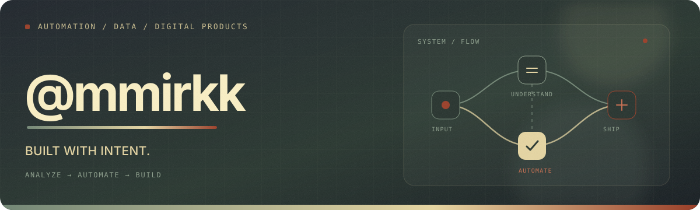

  

<h3 align="center">Automation, data, and digital products — built with intent.</h3>

  I work where systems, information, and product thinking meet. 
  I connect tools, turn raw data into useful signals, and build digital solutions that reduce friction.

  Automatizo procesos, transformo datos en información útil y diseño soluciones digitales pensadas para resolver problemas reales.

---

## What I build

### `01` Automation & Integrations

I connect systems, APIs, and data sources to replace repetitive work with reliable flows. From operational automations to reporting pipelines, the goal is always the same: fewer manual steps and clearer processes.

### `02` Data & Decision Support

I organize information so it can answer real questions. That includes data models, quality checks, dashboards, analysis, and reports designed to make decisions easier to understand and act on.

### `03` Digital Products

I turn needs into usable tools: internal web applications, focused interfaces, integrations, and AI-assisted prototypes. I care about the whole path from a rough problem to a solution people can actually use.

---

## Toolkit

- **Automate** — `n8n` · `Node.js` · `Python` · `Postman`
- **Understand** — `SQL` · `Power BI` · `Azure`
- **Build & ship** — `React` · `Node.js` · `GitHub`

---

## GitHub pulse

  <a href="https://github.com/mmirkk?tab=repositories">
    <picture>
      <source
        media="(prefers-color-scheme: dark)"
        srcset="https://github-profile-summary-cards.vercel.app/api/cards/stats?username=mmirkk&amp;theme=transparent&amp;title_color=e5d5a2&amp;text_color=c6d0c5&amp;bg_color=00000000&amp;border_color=00000000&amp;icon_color=8d9f8c"
      />
      <source
        media="(prefers-color-scheme: light), (prefers-color-scheme: no-preference)"
        srcset="https://github-profile-summary-cards.vercel.app/api/cards/stats?username=mmirkk&amp;theme=transparent&amp;title_color=657a69&amp;text_color=343b43&amp;bg_color=00000000&amp;border_color=00000000&amp;icon_color=9a3f29"
      />
      
    </picture>
  </a>

---

  <strong>Curious by nature. Builder by habit.</strong> 
  Explore the work, experiments, and ideas taking shape across my repositories.

  <a href="https://github.com/mmirkk?tab=repositories"><strong>Browse repositories →</strong></a>

